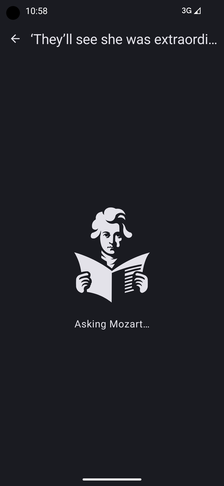
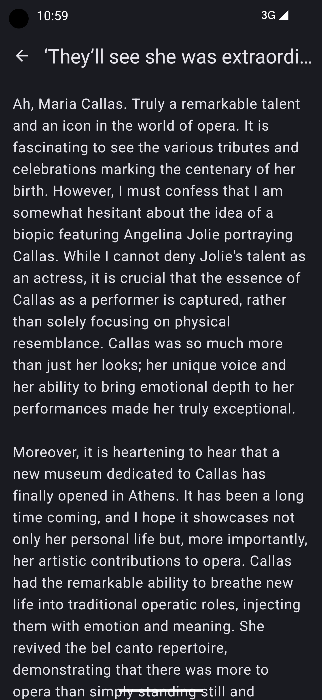
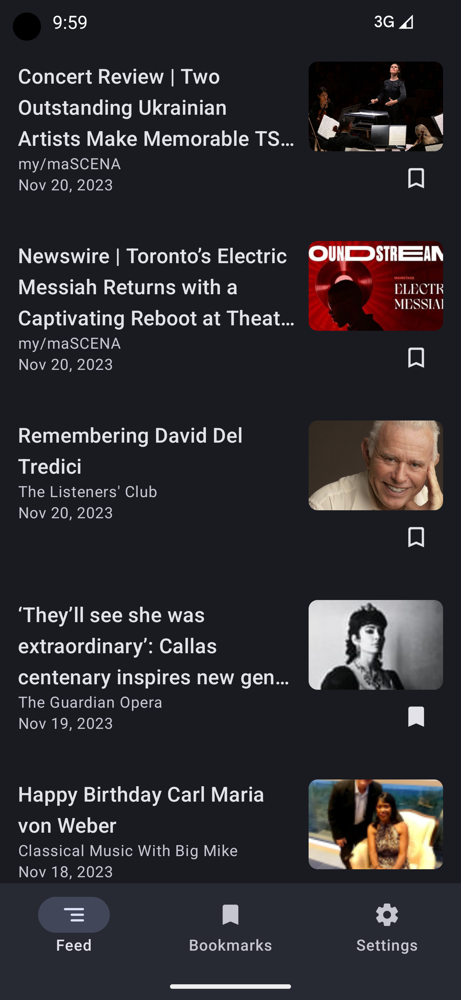
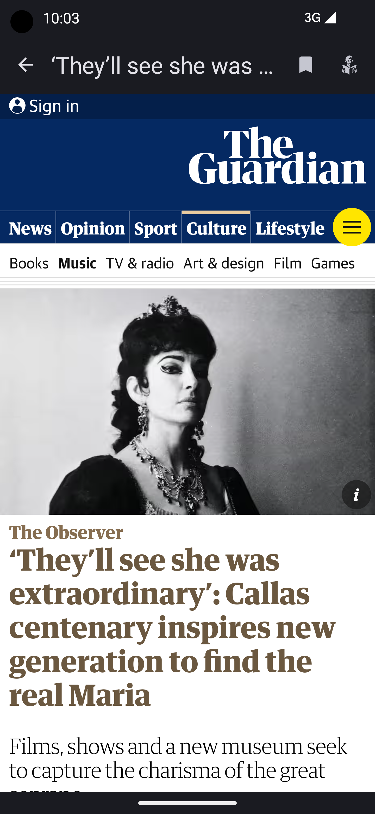
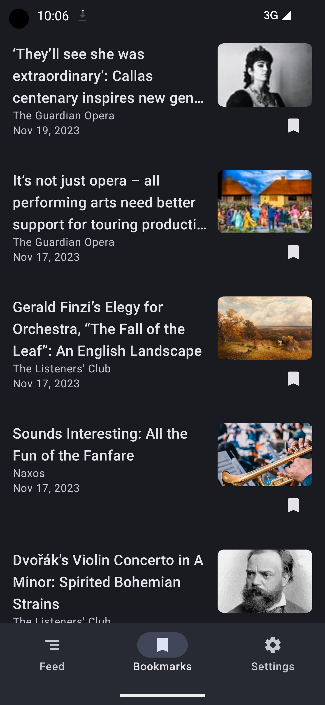
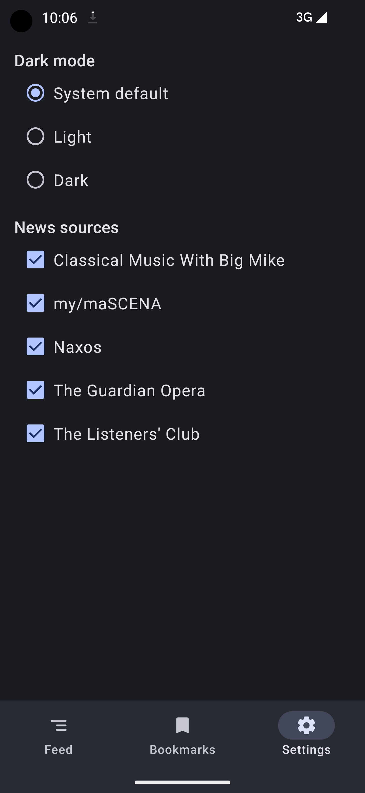
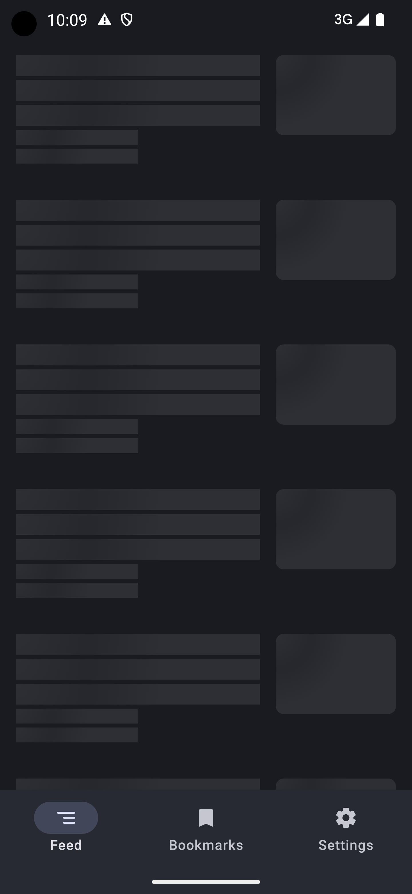
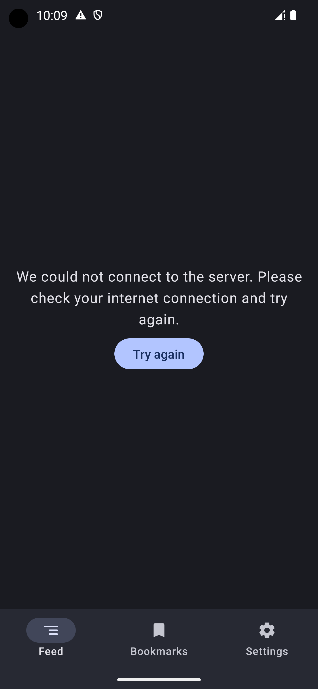

# Table of Contents
1. [About the App](#about-the-app)
2. [About the Code](#about-the-code)
3. [Screenshots](#screenshots)

# About the app

Classical Music News (CMN) is an RSS feed reader for news about classical music.

CMN lets you ask Mozart's opinion about the news article. You can do this by clicking the Mozart button in the top-right corner of the Details screen. When you click it, an API call is made to a simple Node/Typescript/Express backend that's hosted on Replit. The CMN backend fetches article text based on the link query parameter and passes it along to a GPT 3.5 turbo model via the Open AI API. The AI model is instructed to be Mozart resurrected and ready to give his opinions on classical music news articles.

  
   ➡️ 
  

You can select light mode or dark mode on the Settings screen.

You can disable RSS sources on the Settings screen.

Articles on the Feed screen and Bookmarks screen, user preferences and Mozart opinions are persisted in local storage.

Articles are refreshed when the app resumes and it's been at least 60 seconds since the last time articles were refreshed as a result of resuming.

Screens have shimmering placeholders while loading and retryable error messages when the screen fails to load. 

The Feed screen will not be in an error state while it has at least some articles to show. This is to make the Feed screen not depend on every RSS feed working.

The Feed screen has a pull-refresh feature.

# About the code

The architecture is MVVM and Clean Architecture. The code is layered into View, ViewModel, UseCase, Repository and local/remote data sources.

The View code is written in Jetpack Compose with Material3.

Hilt is used for dependency injection.

Ktor is used as HTTP client.

Jetpack DataStore is used for storing user preferences.

Room is used as a database for articles.

# Screenshots

## Feed screen

## Detail screen

## Mozart screen loading

## Mozart screen

## Bookmarks screen

## Settings screen

## Feed screen loading

## Feed screen error

